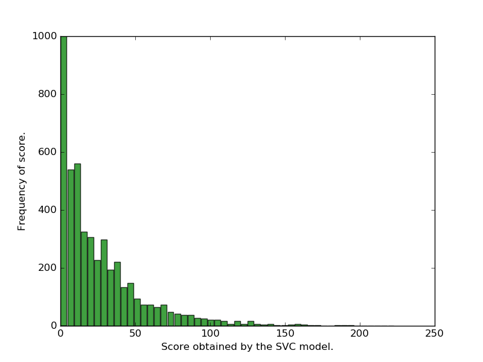
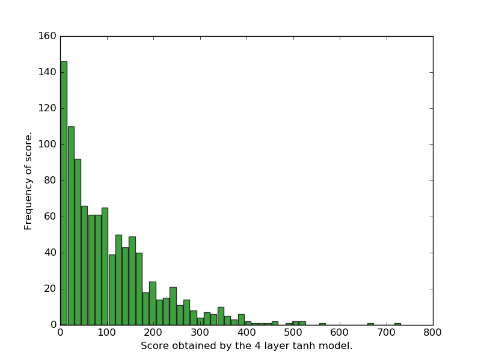
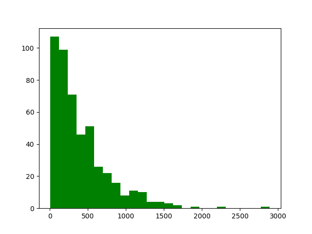
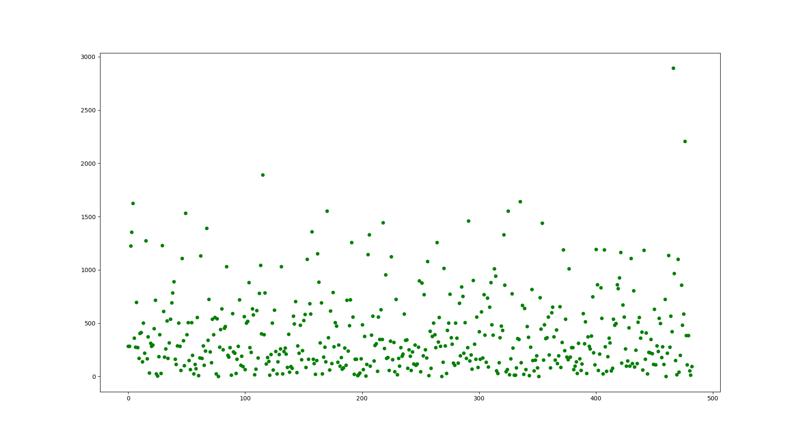

# Learn to Flap

The idea is to show the power of Reinforcement Learning by building supervised learning based baselines and compare the scores with a Q-learning based bot. The training data has been taken by running simulations from [here](https://github.com/chncyhn/flappybird-qlearning-bot) and recording the state and action. Then, we used a standard model-free Q-learning algorithm and compare results.

## Results

For the baseline SVM and neural net models, we required a lot of data. Such data is not feasibly obtained in an arbitrary game. The point of the baseline is to show the effectiveness of RL algorithms. We also experimented on hyperparameter tuning for neural nets, and ran the bot multiple times and recorded the scores. We have included the models as well, so you can reproduce very similar results. After a bit of hyperparameter tuning, we settled for 4 layers with `tanh` and `relu` activations. 

As we can see, the last histogram shows a denser distribution of higher scores than the other networks. All the other networks can barely get a 300+ score whereas the Q-learning model excels at this. Here is a scatter plot of the scores obtained in ~ 500 iterations of the game (Q-learning bot).

## Q-learning nitty-gritties
To make the convergence faster, we employed both the _epsilon greedy_ approach while training to search the state space more rigorously and not settle on locally optimal policies. Also, experience replay was used to keep in mind the previous experiences and learn from them. State space comprised of three parameters - _vertical velocity of bird, distance from immediate pipe (both horizontal and vertical)_. The value of `epsilon` was decayed at a suitable rate and updation was done backwards (from last state to first state), so as to propagate information about the _dead end_ states first. Training is stopped after sufficient convergence. The policy was also kept very simple: `1 point` for being alive, `2 points` for crossing the pipe, and `-100000 points` for crashing. This harsh policy ensured very quick convergence.

## Road ahead
Many different algorithms can be tried keeping this as the baseline because Flappy Bird as a game is simple and can be extended. Different RL algorithms (_A3C_, for example) and genetic algorithms can also be tried on the game as well. 

## Demo
Here are some videos:

[SVC model](https://www.youtube.com/watch?v=Q6B_qvPe29Q)

[NN model](https://www.youtube.com/watch?v=unFUqHdWHaQ)

## Credits
Thanks to [https://github.com/sourabhv/FlapPyBird](https://github.com/sourabhv/FlapPyBird) for providing the raw environment.